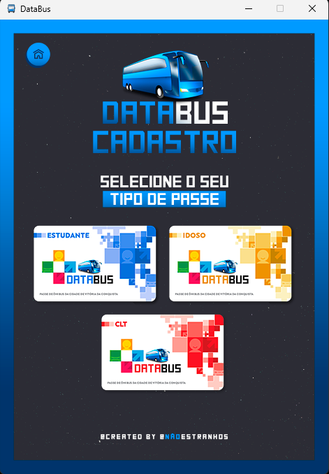

# DataBus

Projeto realizado para a disciplina de Banco de Dados 1, na Universidade Estadual do Sudoeste da Bahia (UESB). O software é uma simulação de um sistema de transporte público.

## Funcionalidades

#### Funcionário
- Gerenciar dados dos clientes
- Buscar dados de um cliente em específico
- Consultar e listar todos os clientes cadastrados
- Gerenciar dados das rotas 
- Consultar e listar todas as rotas disponíveis

#### Cliente
- Cadastro feito pelo próprio cliente, com benefícios para Estudantes, Trabalhadores, e Idosos.
- Visualização das rotas realizadas pela frota de ónibus
- Consulta dos dados pessoais
- Recarga de vale transporte

## Autores

- https://github.com/Luan-Pinheiro
- https://github.com/CarlosGilM
- https://github.com/Yago-0liveira
- https://github.com/oantoniovinicius
- https://github.com/bbering

## 🚀 Sobre nós
Estudantes de Ciência da Computação na Universidade Estadual do Sudoeste da Bahia (UESB).

## Aplicação 🚌
Imagens da Aplicação

        
      
